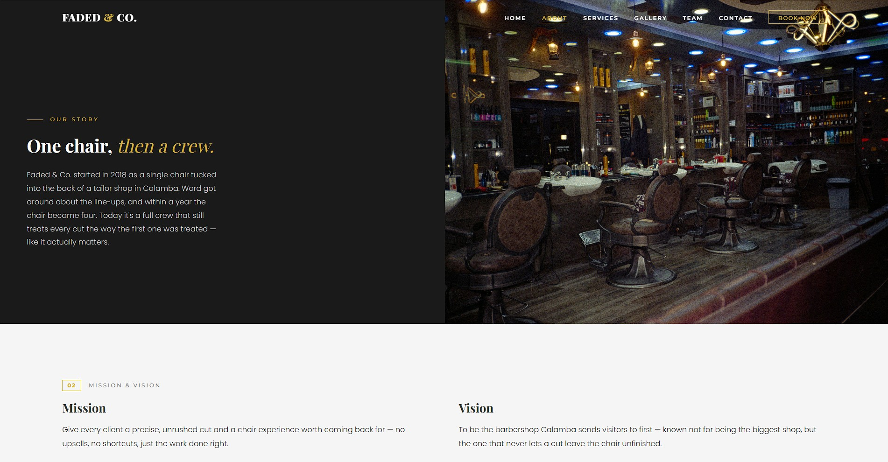
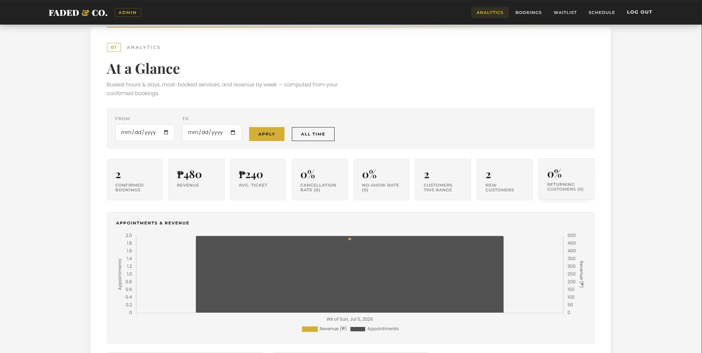
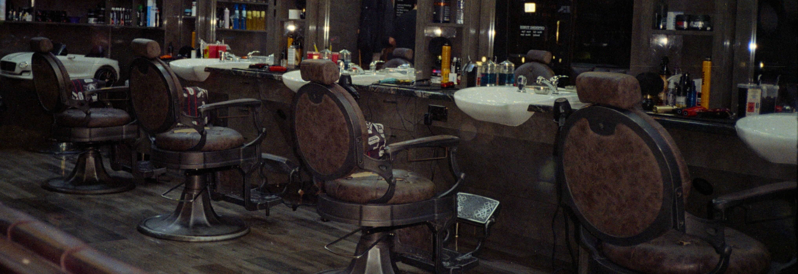

# 💈 Barbershop UX/UI Website

## 📖 Overview
The Barbershop project is a web-based interface designed to provide an engaging and intuitive user experience (UX) for a barbershop business[cite: 1]. It features a clean frontend for customers to learn about the business and an administrative view for backend management[cite: 1].

## ✨ Features
*   **Customer-Facing About Page:** Includes a dedicated `about.html` page to share the barbershop's history, team, and services[cite: 1].
*   **Admin Dashboard:** Features an `admin.html` interface designed for shop management and backend operations[cite: 1].
*   **Rich Media Integration:** Organized structure for visual assets, including dedicated directories for high-quality images and UI icons[cite: 1].
*   **Showcase Galleries:** Built to highlight the shop's environment, utilizing assets like `barber-stations.jpg` to display the interior[cite: 1].
*   **Optimized UX Design:** A dedicated focus on user experience (`ux`) to ensure smooth navigation and a modern aesthetic[cite: 1].

## 💻 Technologies Used
*   **Frontend:** HTML5, CSS3, JavaScript (Vanilla)
*   **Design/UX:** Custom icon sets and optimized image assets[cite: 1]
*   **Architecture:** Static file structure with isolated asset management (`assets/icons/`, `assets/images/`)[cite: 1]

## 🚀 Installation

To get a local copy up and running, follow these simple steps:

1.  **Clone the repository:**
    ```bash
    git clone [Insert Your GitHub Repo Link Here]
    ```
2.  **Navigate to the project directory:**
    ```bash
    cd Barbershop
    ```
3.  **Open the application:**
    Simply open the `.html` files (such as `about.html` or `admin.html`) directly in your preferred web browser, or serve them using a local development server like Live Server in VS Code[cite: 1].

## 🔮 Future Improvements
*   **Dynamic Booking System:** Integrate a backend database to allow users to schedule appointments in real-time.
*   **Authentication:** Add secure login functionality for the `admin.html` dashboard to protect business data.
*   **Responsive Overhaul:** Ensure all UI elements scale perfectly across mobile, tablet, and desktop devices.
*   **Service & Pricing Menu:** Create a dynamic menu fetching real-time prices and stylist availability.

## 📸 Screenshots

| About Us Page | Admin Dashboard | Barber Stations |
| :---: | :---: | :---: |
|  |  |  |

*(Note: Replace the placeholder image paths with the actual paths in your repository).*

## 🔗 Links

*   **Live Demo:** [Insert Live Demo URL Here]
*   **GitHub Repository:** [Insert GitHub Link Here]

---
*Designed with an emphasis on seamless UX for modern barbershops.*[cite: 1]
